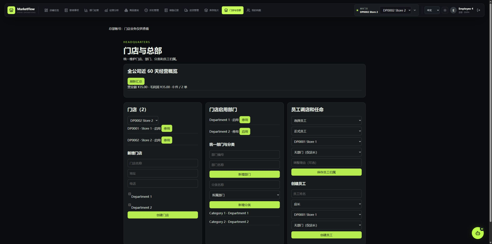
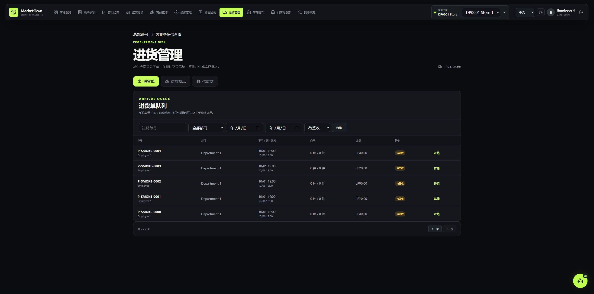

# 四项待办的修复与验收记录

日期：2026-10-04。工作区基于 `36bf63c`，未创建提交、推送或部署到外部服务器。

## 已完成的修改

1. 总部汇总保留显式 `X-Store-ID: all`，请求头大小写也不会影响判断；一般请求仍默认选中的门店。共用日本日期工具统一 60 天计算和原有默认查询范围。
2. 在默认 pytest 中加入两家店的隔离 SQLite 数据库，真实执行 ORM 查询/写入事件、总部管理、AI 历史及待确认服务，新增 25 项测试；模型的 MySQL 时间默认值和 JSON_CONTAINS 仅在测试库做兼容，不改生产模型。
3. 进货单、供应商商品目录、供应商列表接入独立服务端页码，每页 20 条。查询回第一页、末页记录减少回退、翻页失败保留之前页码。创建商品的供应商选项单独分批获取，包含超过 100 条的供应商。进货时间按日本时间显示，跨店供应商详情不再显示编辑按钮。
4. 添加 Vitest、Vue Test Utils 和 jsdom，统一 `npm test`，CI 在 Node 24 上执行 `npm ci`、测试和构建。容器 CI 使用随机生成的独立配置，在临时 runner 上构建 Compose、迁移空库、启动 MySQL/Redis/backend/scheduler/frontend，检查就绪接口与前端入口，最后清理 CI 自己的卷。

## 实测结果

| 项目 | 结果 |
| --- | --- |
| 普通后端测试 | 219 passed，3 项 MySQL 测试默认跳过 |
| MySQL 集成测试 | 3 passed（联络事项测试最终回滚） |
| 前端测试 | 14 passed，覆盖请求范围、日本日期、订货截止、超过 100 个选项、独立分页、查询重置、末页回退和失败处理 |
| 代码与依赖检查 | Ruff、格式检查、MyPy、pip check 通过 |
| 前端生产构建 | vue-tsc 与 Vite build 通过 |
| 业务闭环 | 独立测试库中实际执行订货→幂等重试→签收→防重复签收→折扣→价格预览→销售扣库存→幂等重试→审计→成本/毛利报表 |
| 联络事项闭环 | 独立测试库实际发布→阅读→确认→全员确认关闭→重复确认 |

浏览器通过 computer-use 技能操作本机 Chrome，连接独立测试库：

- 总部 Cookie 登录后，Store 1 的测试营业额为 10，Store 2 为 25；全公司概览为 35、2 单。切换选择 Store 2 后仍为 35。
- Store 1 的 125 张进货单分为 7 页，实际翻到第 7 页显示最后 5 张，超过原先前 100 条范围。
- 在第 7 页查询指定单号，回到第 1 / 1 页并显示唯一匹配单据。
- 测试后退出测试账号，停止临时前后端。现有 MySQL 演示库没有导入测试门店或交易。





## 尚未完成的外部环境验收

- **真实 Gemini/OpenAI 调用**：当前数据库没有已配置的 AI API Key。本次验证了模拟供应商返回以及实际持久会话/业务确认逻辑，没有调用真实供应商，也没有把用户数据发给外部 AI。
- **本机 Docker 运行**：当前系统没有 Docker 命令。新增 CI 配置已做结构检查，但尚未提交触发，不能报告容器构建、空库迁移或启动已经成功。
- **HTTPS 和并发**：本地浏览器使用 HTTP 测试环境，不代表生产 Secure Cookie、证书和反向代理验收完成。SQLite 测试不覆盖 MySQL 的 FOR UPDATE 并发锁，仍需隔离 MySQL 并发验收。

有测试 Key 后可在 AI 助手配置 Gemini 或 OpenAI，依次验证查询、产生待确认修改、取消、确认、刷新恢复历史。只用测试门店和可回退数据。容器部署应在隔离环境按 README 构建、迁移、启动，并通过 HTTPS 测试登录；不要直接对现有演示库重新初始化。

## 重跑命令

项目根目录：

```powershell
.\.venv\Scripts\python.exe -m pip install -r requirements-dev.txt
.\.venv\Scripts\python.exe -m pytest
.\.venv\Scripts\python.exe -m ruff check .
.\.venv\Scripts\python.exe -m ruff format --check .
.\.venv\Scripts\python.exe -m mypy app
```

前端目录（Node 24）：

```powershell
npm.cmd ci
npm.cmd test
npm.cmd run build
```

MySQL 集成测试开关仍为 `RUN_MYSQL_TESTS=1`；普通测试使用隔离数据库，不依赖演示数据。项目依赖与锁文件已更新，换机需按上述命令安装新增测试依赖。
