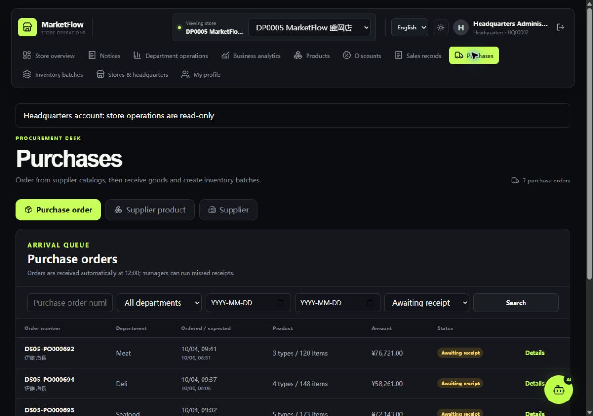
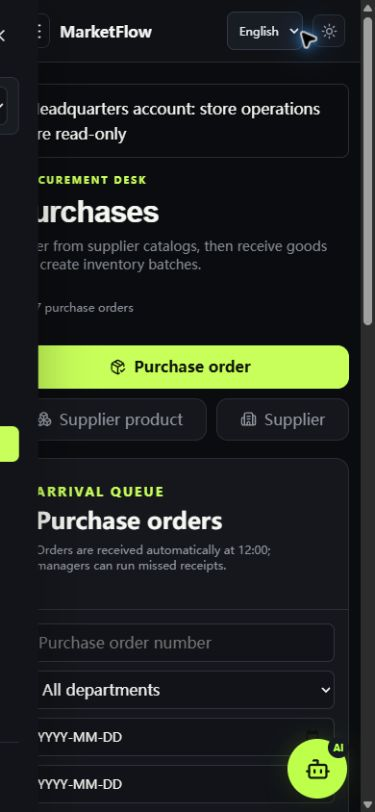

# 前端语言与布局修复验收

日期：2026-10-04（日本时间）。

完整翻译总部只读提示、查询店选择、待签收状态、部门名称、采购提示、AI 历史界面和各页面英文装饰标题。整句匹配优先，避免把新句子中的零散词语替换成英文后留下中文。性别、雇佣状态等表单选项固定原始提交值；切换显示语言不会改变业务枚举。人名、商品名、供应商名、地址和会话正文保留原始业务内容，空值提示仍按界面语言显示。

日期输入保留浏览器原生日历、校验和 ISO 值，并使用界面语言显示日期；空值用 YYYY-MM-DD 表示。原生日历弹窗本身由浏览器提供，其语言取决于浏览器配置。

导航改为菜单与店铺/账号控件分行，菜单随可用宽度换行；窄屏使用可滚动抽屉，关闭后不可聚焦隐藏导航。筛选控件自动分列/换行，窄屏表格在自身区域横向滚动。长姓名、金额、详情卡片、总部配置和采购规划区域均增加收缩与换行规则。

验证结果：

- 前端 19 项测试通过，包括所有 Vue 页面的静态中文文案覆盖、选项值检查、反复切换语言、动态节点翻译、原始业务内容保护及日期输入值/校验约束。
- Vue/TypeScript 检查和 Vite 生产构建通过。
- 当前总部账号可访问的 11 个页面，在 1280px 和 390px 下检查外层页面宽度，无整页横向溢出。
- 采购和个人资料页实际验证中文、英文、日文，以及 2560 / 1280 / 1024 / 768 / 390px 的代表布局；总部配置页另检查 320px。
- 实际采购表格数据、部门、状态、筛选日期和长姓名显示正常；手机菜单展开/关闭、浅色/深色切换正常。
- 浏览器测试结束后恢复原来的日语、深色主题、个人资料页和默认窗口尺寸。

验收截图：

