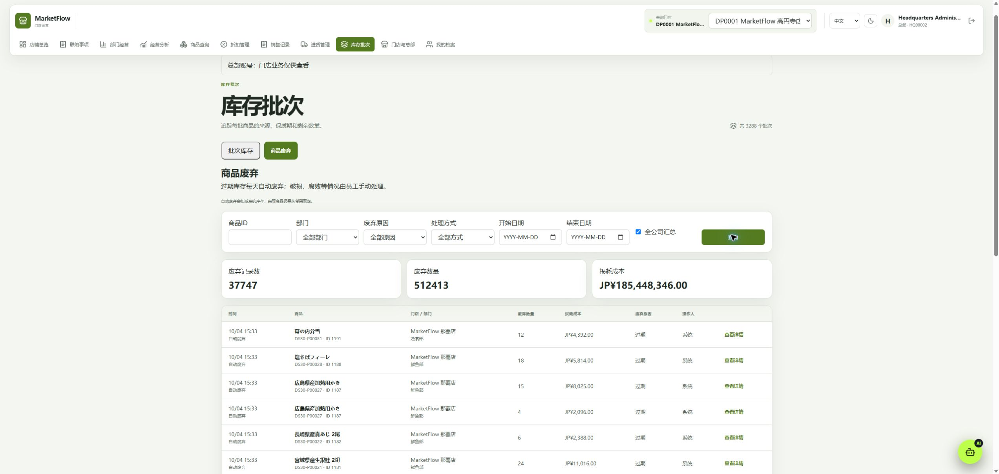
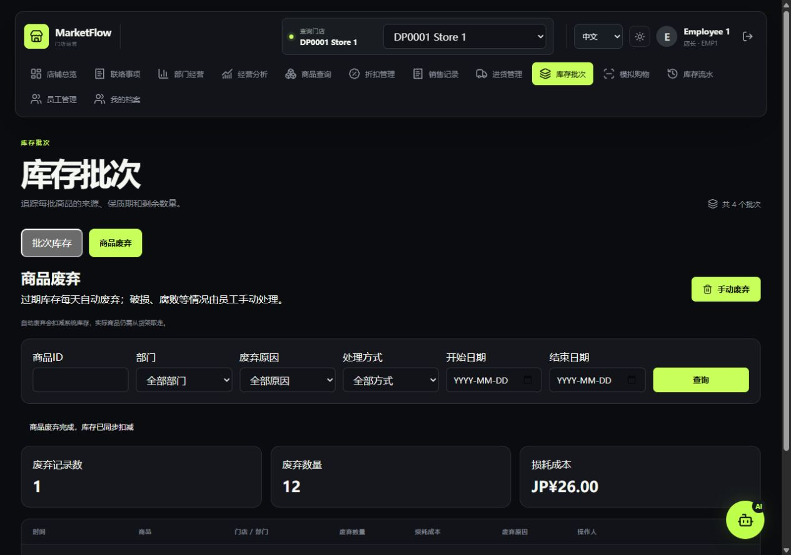

# 商品废弃功能与验收记录

日期：2026-10-04。数据库迁移：`428315d374cd`，在原有 `20261002_0029` 后追加。

## 使用入口

进入 **库存批次 → 商品废弃**。

- 店长可以处理本店商品，正式员工可以处理本部门商品；总部只能查看。跨店业务不能写入。
- 手动废弃：输入商品 ID、查询商品，填写数量，选择破损、腐败、污染或其他原因。选择“其他”必须填写说明。
- 能识别实物批次时选择对应批次；否则自动按最早到期、到货时间、批次 ID 分配。无到期日期的批次排在最后，已经过期或未到货的批次不参与手动分配。
- 点击预览查看各批次扣减数量和损耗成本，确认后执行。库存不足时整笔拒绝；重复请求返回原记录。
- 记录页按日期、部门、商品、原因及自动/手动方式筛选，每页 20 条。汇总数量和金额覆盖全部筛选结果。总部可勾选全公司汇总。
- 商品、店铺、人名和自由说明保留原文，界面支持中文、日语、英语。

## 自动处理与数据记录

每天日本时间 **00:05** 自动废弃到期日期早于当天的剩余库存。到期当天仍然有效。启动调度器时补处理停机期间遗漏的过期库存。沿用现有调度器和分布式锁，每个商品使用独立短事务；失败记录日志，并在后续任务重试。

本机 `.env` 已启用 `APP_RUN_SCHEDULER=true`。生产环境仍按既有部署方式使用独立 scheduler 进程。自动处理仅减少系统库存，员工仍需将实物从货架取走。

新增 `inventory_discard` 和 `inventory_discard_item` 两张表。废弃单、批次数量、商品汇总库存和库存流水在同一事务更新。库存写入统一按商品、批次加锁；汇总数量使用锁定读取，避免 MySQL 旧事务快照覆盖最新数量。损耗成本使用来源进货明细的实际成本，独立展示，不修改历史销售金额或毛利润。

旧过期废弃接口保持兼容，并同步生成新废弃单。库存流水新增 `discard_manual` 类型。

## 当前数据库验收

- 自动补处理 **444 个过期批次、5,685 件商品**，新增损耗成本 **¥2,159,564.00**。处理后过期剩余库存为 0。
- 从已有流水导入 **37,303 条历史过期废弃记录**，只建立记录和明细，没有再次扣减库存。重复导入记录数不变。历史商品、部门和员工名称采用迁移时资料；数量、时间和成本来自旧流水与原批次进货数据。
- 新页面共 **37,747 条记录、512,413 件、¥185,448,346.00**，包含上述历史数据。
- 五项废弃专项 SQL 检查均为 0：单据与明细汇总、明细数量/成本/门店关联、商品库存汇总、过期剩余库存、过期废弃日期边界。结果见 [JSON](inventory-discard-summary.json)。
- 既有演示数据检查中，库存余额、采购销售金额、日期及联络事项时序均无异常；检查脚本整体仍因 **262 条员工个人档案不完整** 返回失败，该项不属于此次库存变更。

## 测试与页面验收

- 后端全量测试：**231 passed / 7 skipped**。新增废弃业务测试覆盖日期边界、跨批次成本、指定批次、库存不足、预览后变化、幂等、权限、筛选、分页和总部汇总。
- 本机 MySQL 可回滚专项：**1 passed**。实际执行废弃、相同请求重试及回滚，确认演示商品库存最终恢复原值。
- 三项真实并发测试需要可创建临时数据库的 `MYSQL_DISCARD_TEST_ADMIN_URL`，本机账号无此权限，尚未在本机运行。已加入 CI 的独立 MySQL 8.4 服务，覆盖相同请求并发、竞争库存、自动与手动同时处理；CI 尚未提交触发。
- 前端：**23 passed**，类型检查、生产构建通过；Ruff、格式检查、MyPy 通过。
- 实际浏览器检查总部记录、全公司汇总和详情，以及中英日切换；390px、768px、1280px 宽度布局验证。
- 独立 SQLite 测试环境中，以店长实际完成“商品查询 → 预览 → 确认 → 记录”：12 件分配到两个批次（10+2），成本 ¥26.00；再次查询可处理库存为 18 件。另验证指定批次 3 件预览成本 ¥9.00，以及英文窄屏窗口。测试未扣减现有 MySQL 的手动业务库存。





## 复核命令

```powershell
.\.venv\Scripts\python.exe -m alembic upgrade head
.\.venv\Scripts\python.exe -m pytest
.\.venv\Scripts\python.exe -m scripts.verify_inventory_discards
cd frontend
npm.cmd test
npm.cmd run build
```
